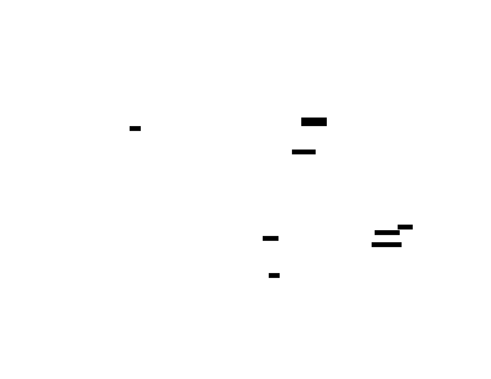

# Architecture

AgentSentinel is built with a modular architecture that separates concerns into testable packages.

## Overview



## Data Flow

1. **Pane Discovery** - Lists all tmux panes via `tmux list-panes`
2. **Content Capture** - Reads each pane's visible content via `tmux capture-pane`
3. **Pattern Matching** - Scans for approval prompts using regex patterns
4. **Danger Check** - Verifies the command isn't dangerous
5. **Keystroke Injection** - Sends `y` + Enter via `tmux send-keys`

## Package Structure

```
agentsentinel/
├── main.go                 # Entry point
├── cmd/                    # CLI commands (Cobra)
│   ├── root.go             # Root command, --verbose flag
│   ├── watch.go            # Watch command setup and main loop
│   ├── status.go           # Show tmux status
│   ├── config.go           # Configuration management
│   ├── test.go             # Pattern detection tests
│   ├── stats.go            # Statistics display
│   └── version.go          # Version info
└── internal/
    ├── watcher/            # Core watch logic
    │   ├── watcher.go      # Watcher struct, Scan(), interfaces
    │   └── watcher_test.go
    ├── config/             # YAML configuration
    │   ├── config.go       # Load/save ~/.agentsentinel.yaml
    │   └── config_test.go
    ├── detector/           # Prompt detection
    │   ├── detector.go     # Regex pattern matching
    │   └── detector_test.go
    ├── tmux/               # tmux integration
    │   ├── tmux.go         # Pane listing, capture, send-keys
    │   └── tmux_test.go
    ├── stats/              # Statistics tracking
    │   ├── stats.go        # Approval counters, JSON logging
    │   └── stats_test.go
    └── notify/             # macOS notifications
        ├── notify.go       # osascript wrapper
        └── notify_test.go
```

## Key Interfaces

The `internal/watcher` package defines interfaces for dependency injection, enabling unit testing without real tmux:

### TmuxClient

```go
type TmuxClient interface {
    ListPanes() ([]string, error)
    CapturePane(paneID string, lines int) (string, error)
    Approve(paneID string) error
    ApproveMultiple(paneID string, count int, delayMs int) error
}
```

Implemented by `internal/tmux.Client`.

### Notifier

```go
type Notifier interface {
    NotifyApproval(paneID, promptType string) error
    NotifyBlocked(paneID string) error
}
```

Implemented by `internal/notify.Notifier`.

### StatsRecorder

```go
type StatsRecorder interface {
    RecordScan()
    RecordApproval(ctx context.Context, paneID, promptType, line string, blocked bool)
}
```

Implemented by `internal/stats.Stats`.

## Watch Loop

The main watch loop in `cmd/watch.go`:

```go
ticker := time.NewTicker(watchInterval)
for {
    select {
    case <-ticker.C:
        if err := watcher.Scan(ctx); err != nil {
            logger.Error("scan error", "error", err)
        }
    case sig := <-sigChan:
        // Graceful shutdown
        return nil
    }
}
```

Each `Scan()` call:

1. Lists all tmux panes
2. Skips recently approved panes
3. Captures content from each pane
4. Runs detection patterns
5. Checks for dangerous commands
6. Sends approval if safe

## Kiro Multi-Subagent Handling

For Kiro's multi-subagent TUI:

```go
if detector.IsKiroPrompt(detection.Line) {
    cycleCount := max(detection.Count, 4)
    client.ApproveMultiple(paneID, cycleCount, 100)
}
```

`ApproveMultiple` sends `y` followed by `j` (navigate down) to cycle through all pending approvals.

## Context-Based Logging

Logger is propagated via `context.Context`:

```go
import "github.com/grokify/mogo/log/slogutil"

// Create context with logger
ctx := slogutil.ContextWithLogger(context.Background(), logger)

// Retrieve in functions
func doWork(ctx context.Context) {
    logger := slogutil.LoggerFromContext(ctx, slog.Default())
    logger.Info("working", "key", value)
}
```

## Dependencies

| Package | Purpose |
|---------|---------|
| `github.com/spf13/cobra` | CLI framework |
| `gopkg.in/yaml.v3` | YAML configuration |
| `github.com/lmittmann/tint` | Colored slog output |
| `github.com/grokify/mogo` | Context-based logging utilities |

## Test Coverage

| Package | Coverage |
|---------|----------|
| `internal/watcher` | 85.3% |
| `internal/detector` | 88.9% |
| `internal/stats` | 88.7% |
| `internal/config` | 73.9% |
| `internal/tmux` | 53.4% |
| `internal/notify` | 50.0% |

## D2 Diagram Source

The architecture diagram is generated from D2:

```bash
# Render SVG from D2 source
d2 docs/architecture.d2 docs/architecture.svg
```

Source: [`docs/architecture.d2`](https://github.com/plexusone/agentsentinel/blob/main/docs/architecture.d2)
